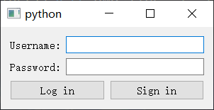

# 第五章 完善登录框小程序

&emsp;&emsp;在这一章中，我们结合前面所学的知识来完善登录框小程序。<br>
&emsp;&emsp;为方便起见，我们先引入该程序用到的模块和组件：

```python
# encoding: utf-8
import sys
from PyQt5.QtWidgets import QApplication, QWidget, QDialog, QLabel, QLineEdit, QPushButton, \
    QGridLayout, QVBoxLayout, QHBoxLayout, QMessageBox
```

## 5.1 登录界面布局

&emsp;&emsp;首先完成登录界面布局，请看下方代码：

```python
class Demo(QWidget):
    def __init__(self):
        super(Demo, self).__init__()
        self.resize(300, 100)

        self.user_label = QLabel('Username:', self)
        self.pwd_label = QLabel('Password:', self)
        self.user_line = QLineEdit(self)
        self.pwd_line = QLineEdit(self)
        self.login_button = QPushButton('Log in', self)
        self.signin_button = QPushButton('Sign in', self)

        self.grid_layout = QGridLayout()
        self.h_layout = QHBoxLayout()
        self.v_layout = QVBoxLayout()

        self.layout_init()

    def layout_init(self):
        self.grid_layout.addWidget(self.user_label, 0, 0, 1, 1)
        self.grid_layout.addWidget(self.user_line, 0, 1, 1, 1)
        self.grid_layout.addWidget(self.pwd_label, 1, 0, 1, 1)
        self.grid_layout.addWidget(self.pwd_line, 1, 1, 1, 1)
        self.h_layout.addWidget(self.login_button)
        self.h_layout.addWidget(self.signin_button)
        self.v_layout.addLayout(self.grid_layout)
        self.v_layout.addLayout(self.h_layout)

        self.setLayout(self.v_layout)


if __name__ == "__main__":
    app = QApplication(sys.argv)
    demo = Demo()
    demo.show()
    sys.exit(app.exec_())
```

&emsp;&emsp;程序首先将窗口的宽设为 300，长设为 100，接着实例化了几个控件：两个文本控件、两个单行文本输入框和两个按钮；然后搭配使用网格布局管理器、水平布局管理器和垂直布局管理器来完成整个界面的布局。这里不再详细解释代码的意思。<br>
&emsp;&emsp;有一点需要注意一下，我们把布局管理专门放在了一个函数 layout_init() 中，然后只用在初始化函数中加上 layout_init() 就行。把对不同控件的操作分开来放在相应的函数中，这样写不仅可以让代码更加清晰明了，也方便日后维护。<br>
&emsp;&emsp;此时程序运行截图如下：

<div align = center>

</div>

## 5.2 完善单行文本输入框和按钮功能

&emsp;&emsp;该步骤要完成的结果与前面示例类似，不同的是在单行文本输入框中有浅灰色的提示文字，Log in 按钮刚开始无法点击，只能等两个输入框中都有文本输入的时候才可以进行点击。<br>
&emsp;&emsp;首先对输入框功能进行完善。

```python
    def lineEdit_init(self):
        self.user_line.setPlaceholderText('Please enter your username')
        self.pwd_line.setPlaceholderText('Please enter your password')

        self.user_line.textChanged.connect(self.check_input_func)
        self.pwd_line.textChanged.connext(self.check_input_func)
```

&emsp;&emsp;在未输入前，我们会看到输入框上就已经有了一行浅灰色的提示文字，但点击的话浅灰色的文字就会不见。这种功能就是通过 setPlaceholderText() 方法来实现的。在这里还进行了信号和槽的连接，将 QLineEdit 的 textChanged() 信号连接到一个自定义的槽 self.check_input_func 上。textChanged() 信号会在输入框中文本发生变化的时候发出，所以槽函数的任务就是判断两个输入框是否都有文字了：

```python
    def check_input_func(self):
        if self.user_line.text() and self.pwd_line.text():
            self.login_button.setEnabled(True)
        else:
            self.login_button.setEnabled(False)
```

&emsp;&emsp;如果账号框和密码框都有文本（通过 text() 方法获取输入框文本），那就使登录按钮可用（setEnabled(True)），否则登录按钮不可用。<br>
&emsp;&emsp;接下来对按钮进行完善：

```python
    def pushbutton_init(self):
        self.login_button.setEnabled(False)
```

&emsp;&emsp;使刚开始显示的登录按钮不可用，只有等账号框和密码框都有文本的时候才能用（上面的槽函数）。<br>
&emsp;&emsp;当我们点击登录按钮的时候，账号框和密码框都有文本了，那点击后肯定是要验证账号密码是否正确：

```python
    def pushbutton_init(self):
        self.login_button.setEnabled(False)
        self.login_button.clicked.connect(self.check_login_func)
```

&emsp;&emsp;所以我们将登录按钮的 clicked 信号和一个用于检查账号密码是否正确的自定义槽函数连接起来。<br>
&emsp;&emsp;首先我们在程序的最开始处定义一个全局变量 USER_PWD：

```python
import sys
from PyQt5.QtWidgets import QApplication, QWidget, QDialog, QLabel, QLineEdit, QPushButton, \
    QGridLayout, QVBoxLayout, QHBoxLayout, QMessageBox

USER_PWD = {
    'la_vie': 'password'
}
```

&emsp;&emsp;该字典的键 'la_vie' 就是当做账号，值 'password' 就当做密码（之后复杂的程序会使用数据库，这里就先简单定义一个全局变量来使用）。<br>
&emsp;&emsp;然后定义检查账号密码的槽函数：

```python
    def check_login_func(self):
        if USER_PWD.get(self.user_line.text()) == self.pwd_line.text():
            QMessageBox.information(self, 'Information', 'Log in Successfully!')
        else:
            QMessageBox.information(self, 'Wrong', 'Wrong Username or Password!')

        self.user_line.clear()
        self.pwd_line.clear()
```

&emsp;&emsp;将账号框的文本当做 get() 的参数来获取值，然后跟密码框的文本进行比较，若相同则显示信息框提示登录成功，否则显示账号或密码错误。最后无论成功还是失败，都会用 clear() 方法来清空账号框和密码框。<br>
&emsp;&emsp;最后将 self.lineEdit_init() 和 self.pushbutton_init() 放在类的初始化函数中：

```python
class Demo(QWidget):
    def __init__(self):
        super(Demo, self).__init__()
        self.resize(300, 100)

        self.user_label = QLabel('Username:', self)
        self.pwd_label = QLabel('Password:', self)
        self.user_line = QLineEdit(self)
        self.pwd_line = QLineEdit(self)
        self.login_button = QPushButton('Log in', self)
        self.signin_button = QPushButton('Sign in', self)

        self.grid_layout = QGridLayout()
        self.h_layout = QHBoxLayout()
        self.v_layout = QVBoxLayout()

        self.lineEdit_init()        # 单行文本输入框
        self.pushbutton_init()      # 按钮
        self.layout_init()
```

&emsp;&emsp;此时程序运行截图如下：

<div align=center>
<image src="./images/5-5-2-1.png">
</div>

&emsp;&emsp;输入 la_vie 和 password，点击 Log in 按钮，则显示信息框提示登录成功。

<div align=center>
<image src="./images/5-5-2-2-succeed.png">
</div>

&emsp;&emsp;输入一个错误的账号或错误的密码，就会显示错误框提示账号或密码错误：

<div align=center>
<image src="./images/5-5-2-2-fail.png">
</div>

点击 OK 后，账号框和密码框文本都被清空，恢复原状：

<div align=center>
<image src="./images/5-5-2-1.png">
</div>

## 5.3 完善注册界面布局及功能

&emsp;&emsp;接下来就是要完善 Sign in 这个按钮的功能。这里我们想的是点击这个按钮后，会出现一个新的界面用于注册。<br>
&emsp;&emsp;该界面一共是由三个 QLabel、三个 QLineEdit 和一个 QPushButton 组成的，首先来完成界面布局：

```python
class SigninPage(QDialog):
    def __init__(self):
        super(SigninPage, self).__init__()
        self.signin_user_label = QLabel('Username:', self)
        self.signin_pwd_label = QLabel('Password:', self)
        self.signin_pwd2_label = QLabel('Password:', self)
        self.signin_user_line = QLineEdit(self)
        self.signin_pwd_line = QLineEdit(self)
        self.signin_pwd2_line = QLineEdit(self)
        self.signin_button = QPushButton('Sign in', self)

        self.user_h_layout = QHBoxLayout()
        self.pwd_h_layout = QHBoxLayout()
        self.pwd2_h_layout = QHBoxLayout()
        self.all_v_layout = QVBoxLayout()

        self.layout_init()

    def layout_init(self):
        self.user_h_layout.addWidget(self.signin_user_label)
        self.user_h_layout.addWidget(self.signin_user_line)
        self.pwd_h_layout.addWidget(self.signin_pwd_label)
        self.pwd_h_layout.addWidget(self.signin_pwd_line)
        self.pwd2_h_layout.addWidget(self.signin_pwd2_label)
        self.pwd2_h_layout.addWidget(self.signin_pwd2_line)

        self.all_v_layout.addLayout(self.user_h_layout)
        self.all_v_layout.addLayout(self.pwd_h_layout)
        self.all_v_layout.addLayout(self.pwd2_h_layout)
        self.all_v_layout.addWidget(self.signin_button)

        self.setLayout(self.all_v_layout)
```

&emsp;&emsp;这里我们新写一个类，并继承于 QDialog（另一个毛胚房）。QDialog 就是指对话框，我们平时在软件中点击“打开”或“另存为”而出现的文件对话框就是其中一种。当然这里也可以同样继承于 QWidget，但是 QDialog 中有一个方法是 QWidget 所不具有的，稍后来讲述。<br>
&emsp;&emsp;首先同样将 Sign in 按钮设为不可用（setEnable(False)），并且只有当三个输入框中都有文本的时候，才会启用这个按钮，原理和之前一样：

```python
    def lineEdit_init(self):
        self.signin_user_line.textChanged.connect(self.check_input_func)
        self.signin_pwd_line.textChanged.connect(self.check_input_func)
        self.signin_pwd2_line.textChanged.connect(self.check_input_func)
```

&emsp;&emsp;在 lineEdit_init() 中我们将是三个输入框的 textChanged() 信号跟自定义的 check_input_func() 槽函数进行连接：

```python
    def check_input_func(self):
        if self.signin_user_line.text() and self.signin_pwd_line.text() and self.signin_pwd2_line.text():
            self.signin_button.setEnabled(True)
        else:
            self.signin_button.setEnabled(False)
```

&emsp;&emsp;在槽函数中我们判断三个输入框是否都有文本，有的话则将按钮启用，否则禁用：

```python
    def pushbutton_init(self):
        self.signin_button.setEnabled(False)
        self.signin_button.clicked.connect(self.check_signin_func)
```

&emsp;&emsp;然后在 pushbutton_init() 中先将 sign in 按钮设为禁用状态，然后将 clicked() 信号和之后自定义的 check_signin_func() 槽函数连接起来。因为在点击注册按钮的时候我们要对输入的文本的内容进行检查，看符不符合要求：

```python
    def check_signin_func(self):
        if self.signin_pwd_line.text() != self.signin_pwd2_line.text():
            QMessageBox.critical(self, 'Wrong', 'Two Passwords Typed Are Not Same!')
        elif self.signin_user_line.text() not in USER_PWD:
            USER_PWD[self.signin_user_line.text()] = self.signin_pwd_line.text()
            QMessageBox.information(self, 'Information', 'Register Successfully')
        else:
            QMessageBox.critical(self, 'Wrong', 'This Username Has Been Registered!')

        self.signin_user_line.clear()
        self.signin_pwd_line.clear()
        self.signin_pwd2_line.clear()
```

&emsp;&emsp;首先判断两次密码输入框输入的文本是否一致，若不相同的话，则显示错误框提示；当然我们还要对注册的账号进行判断，如果在字典没有相对应的键，说明该账号没有被注册过，接着将要注册的账号和密码放进字典中，并显示信息框提示注册成功。self.close() 是指关闭对话框自身，也就是在信息框按钮被按下去关闭之后，注册界面的对话框也要一起关闭。最后一种情况就是账号已经被注册过了，于是显示错误框来进行提示。<br>
&emsp;&emsp;无论哪种情况，最后都会将三个输入框的文本清空掉。<br>
&emsp;&emsp;那么最后将 self.lineEdit_init() 和 self.pushbutton_init() 放在类的初始化函数中：

```python
class SigninPage(QDialog):
    def __init__(self):
        super(SigninPage, self).__init__()
        self.signin_user_label = QLabel('Username:', self)
        self.signin_pwd_label = QLabel('Password:', self)
        self.signin_pwd2_label = QLabel('Password:', self)
        self.signin_user_line = QLineEdit(self)
        self.signin_pwd_line = QLineEdit(self)
        self.signin_pwd2_line = QLineEdit(self)
        self.signin_button = QPushButton('Sign in', self)

        self.user_h_layout = QHBoxLayout()
        self.pwd_h_layout = QHBoxLayout()
        self.pwd2_h_layout = QHBoxLayout()
        self.all_v_layout = QVBoxLayout()

        self.lineEdit_init()            # 单行文本输入框
        
        self.pushbutton_init()          # 按钮
        self.layout_init()
```

## 5.4 整合登录界面和注册界面
